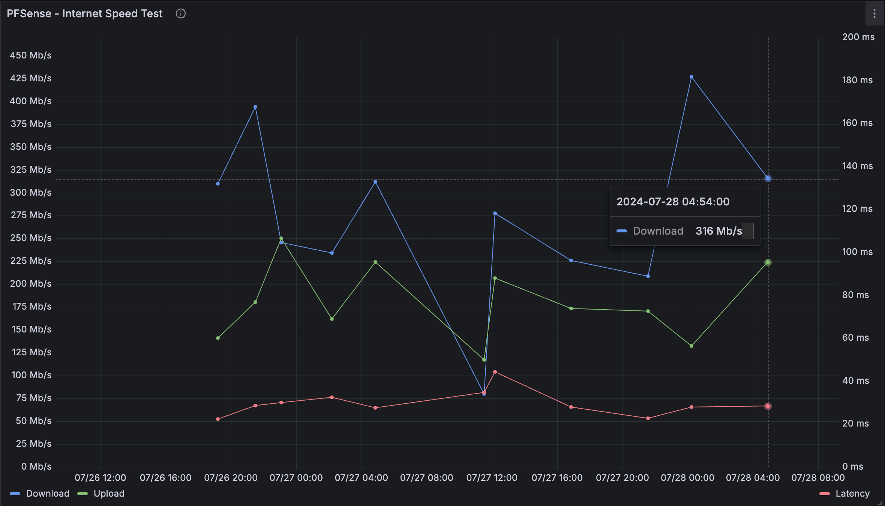

# pfsense-speedtestToInflux
Bash scripts that can be run from cron on PFSense to periodically execute speedtest-cli and upload Internet connectivity performance data to an Influx DB database. From there, you can graph performance over time with Grafana or create automations to take action for anomalies such as rebooting the cable modem.


<sub>Example Grafana dashboard made possible by periodically collecting speedtest-cli results in an Influx DB.</sub>

## Prerequisites 
- SSH access to PFSense shell
- jq installed on PFSense
- speedtest-cli installed on PFSense

## Install
Copy or scp to /usr/local/bin:
- speedtestToInflux.sh
- cronRandomDelay.sh

```
chmod +x speedtestToInflux.sh
chmod +x cronRandomDelay.sh

crontab -e
```

Add the following line to crontab to run the test 4 times per day, randomily within each 6 hour period:

```
0 */6 * * *	/usr/local/bin/cronRandomDelay.sh /usr/local/bin/speedtestToInflux.sh 21600
```
